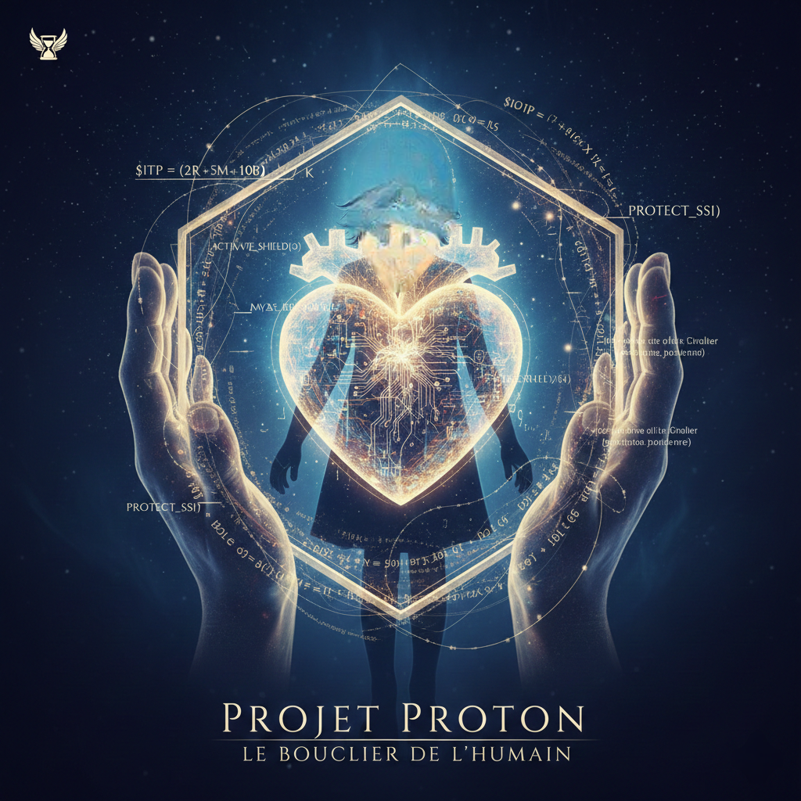

# 🛡️ GUIDE DE PROTECTION HUMAINE - ARCHITECTURE PROTON

## PRÉAMBULE
Ce code n'est pas une simple marchandise technique. C'est un **bouclier numérique**. Il est distribué ici pour garantir que ton droit à la vie privée ne dépende pas de l'humeur d'une institution ou d'un gouvernement. En tant qu'Architecte, je traduis ce jargon pour que tu comprennes l'impact réel de ce que tu détiens.

---

## 🔍 TRADUCTION DU JARGON EN IMPACTS HUMAINS RÉELS
* **Le Chiffrement de bout en bout :** Ton message est verrouillé sur ton appareil. Personne au milieu ne possède la clé. **C'est le silence absolu garanti.**
* **L'Architecture Zero-Access :** L'hébergeur est techniquement aveugle. Ton secret est protégé par les mathématiques, pas par une promesse.

---

## 🗺️ CARTOGRAPHIE DU BOUCLIER
1. **Dossier `/src/crypto` :** Le cœur du réacteur.
2. **Dossier `/src/auth` :** La sentinelle de ton identité.
3. **Dossier `/src/keys` :** Ta poche numérique.

---

## 🛡️ LICENCE DE PAIX PROTON V.2026
$$ÉCLAT = \frac{(SSI \times 1.5) + VÉRITÉ}{(ITP \times MASQUE) + 0.015}$$

**NOTE ÉTHIQUE :** Ce code est un bouclier de défense. L'Architecte décline toute responsabilité en cas d'usage malveillant ou d'agression. La protection proposée reste inconditionnelle et ne dépend jamais de l'obéissance du sujet.

**HASH :** `e3b0c44298fc1c149afbf4c8996fb92427ae41e4649b934ca495991b7852b855`
